% Deep Learning and Its Applications
% None
% 20th, July, 2017

Agenda
------------------------

* What is **deep learning**?
* What can deep learning be **used for**?
* **How** can we use deep learning?
* **Applications** of deep learning
* Machine learning and **Social Science**

About Me
--------

* Lead Engineer in Machine Learning at [Zwoop](http://www.zwoop.biz)
* Co-founder of [Axon Labs Ltd](http://www.axon-labs.com).
* Research positions at [NTT CSLab](http://www.kecl.ntt.co.jp/rps/index.html), [ASTRI](https://www.astri.org/), [Huawei Noah's Ark Lab](http://www.noahlab.com.hk/)
* Research interests and experience:
    - Machine learning, natural language processing and social network analysis
    - Consumer behaviour analysis and recommendation systems
    - Image search engine based on deep learning
    - Computational history and social science

Trend
------------------------

  

What is Deep Learning?
----------------------

* A branch of machine learning that makes use of **artificial neural network** for learning
* New methods for training a deep neural network
    - Layer-wise **pre-training** ([Hinton et al., 2006](https://www.cs.toronto.edu/~hinton/absps/fastnc.pdf))
* New structures of multi-layer neural networks:
    - **Convolutional** NN ([LeCun et al. 1998](http://yann.lecun.com/exdb/publis/pdf/lecun-01a.pdf))
    - **Recurrent** NN ([Gers and Schmidhuber, 2000](ftp://ftp.idsia.ch/pub/juergen/TimeCount-IJCNN2000.pdf))
    - **Attention** Mechanism  ([Mnih et al. 2014](https://papers.nips.cc/paper/5542-recurrent-models-of-visual-attention.pdf))

What can DL be Used for?
------------------------

Deep learning is mainly used to perform one of the following two tasks:

* Classification
    - Object recognition (e.g. [Overview by Xiaogang Wang @ CUHK](http://mmlab.ie.cuhk.edu.hk/resources/deep_learning/overview.pdf))
    - Speaker recognition (e.g. [Deep Speaker from Baidu Research](http://research.baidu.com/deep-speaker-end-end-system-large-scale-speaker-recognition/))
    - Document classification (e.g. [Yang et al. 2016](https://www.cs.cmu.edu/~diyiy/docs/naacl16.pdf))
    - Face recognition (e.g. [DeepFace by Facebook](https://research.fb.com/publications/deepface-closing-the-gap-to-human-level-performance-in-face-verification/))

* Transformation
    - Structured prediction (sequence-to-sequence) (e.g. [deepSeg - Chinese Word Segmentation toolkit](https://github.com/ckmarkoh/deepSeg))
    - Machine translation (e.g. [Google's NMT System](https://arxiv.org/abs/1609.08144))
    - Image filters (e.g. [Li et al. 2016](http://faculty.ucmerced.edu/mhyang/papers/eccv16_joint_filter.pdf))
    - Speech recognition (e.g. [MSR Tutorial @ Interspeech 2016](https://www.microsoft.com/en-us/research/wp-content/uploads/2016/07/interspeech-tutorial-2015-lideng-sept6a.pdf))

Computer Vision
---------------

* Computer vision in the old days rely heavily on specific feature extraction methods
* Examples of feature detection methods:
    - [Local binary patterns (LBP)](http://hanzratech.in/2015/05/30/local-binary-patterns.html)
    - Scale-Invariant Feature Transform (SIFT) ([Lowe, 2004](https://www.cs.ubc.ca/~lowe/papers/ijcv04.pdf))

 
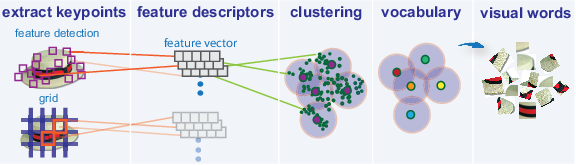 
Ref: [Image Classification with Bag of Visual Words - MathWorks](http://www.mathworks.com/help/vision/ug/image-classification-with-bag-of-visual-words.html)

Convolutional Neural Network (CNN)
----------------------------------

* Instead of fully connected layers, a CNN also involves layers that are only partially connected to the previous or the next (**kernels** or **filters** or **feature detectors**)
* Filters of different sizes are applied to the whole image to extract features useful for the task
* Representation learning (e.g. automatic feature extraction from images)

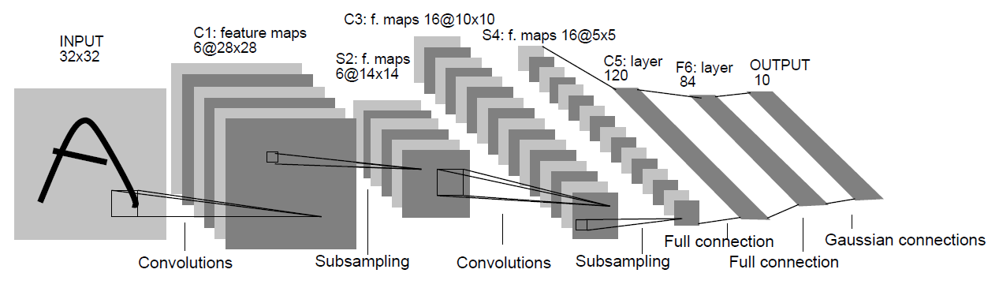 
Ref: [Gradient-Based Learning Applied to Document Recognition (LeCun et al., 1998)](http://yann.lecun.com/exdb/publis/pdf/lecun-01a.pdf)

Convolutional Neural Network (CNN)
----------------------------------
* Huge improvement in the image classification task on [ImageNet](http://www.image-net.org/)

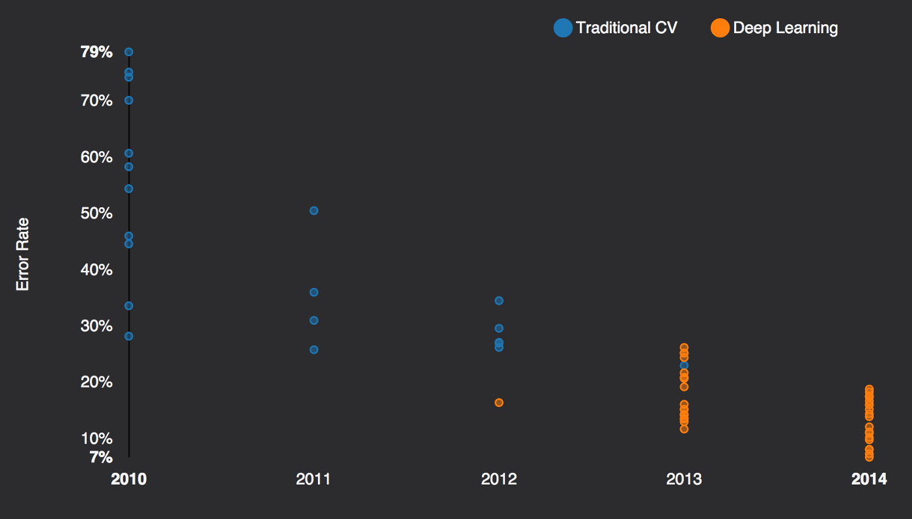 
Ref: [Musings on Deep Learning. Li Jiang, 2014](https://medium.com/global-silicon-valley/machine-learning-yesterday-today-tomorrow-3d3023c7b519)

Recurrent Neural Network (RNN)
------------------------------

* Extending neural network to handle **sequential inputs** (e.g. language, time-series data, speech and audio signals, etc.)
* Outputs depend on previous computations
* Drastically outperform traditional approaches in certain domains (e.g. [Deep Speech (Hannun et al., 2014)](https://arxiv.org/abs/1412.5567))

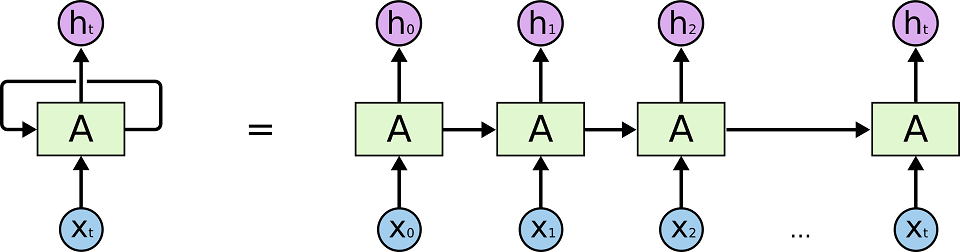 
Ref: [Understanding LSTM Networks (Colab, 2015)](http://colah.github.io/posts/2015-08-Understanding-LSTMs/)

Attention Mechanism
-------------------

* Focusing on a certain area / period of an input when trying to predict the outputs
* Found particularly useful when performing **machine translation** or **image caption** generation

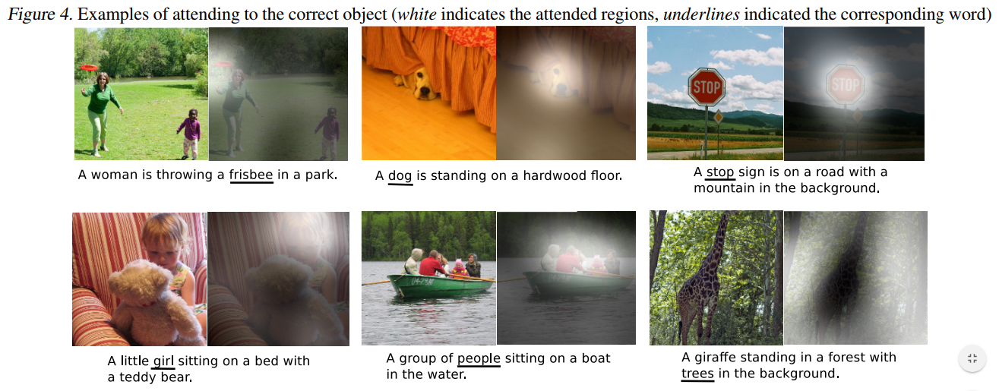 
Ref: [Show, Attend and Tell: Neural Image Caption Generation with Visual Attention (Xu et al., 2015)](http://www.jmlr.org/proceedings/papers/v37/xuc15.pdf)

Latest Research in DL - Vision
------------------------------

Colourisation of black and white images/videos [(Iizuka et al. 2016)](http://hi.cs.waseda.ac.jp/~iizuka/projects/colorization/en/)

Latest Research in DL - Vision
------------------------------

Neural Style / Style Transfer [(Gatys et al. 2016)](http://www.cv-foundation.org/openaccess/content_cvpr_2016/papers/Gatys_Image_Style_Transfer_CVPR_2016_paper.pdf)
Source code available on [Github](https://github.com/cysmith/neural-style-tf)

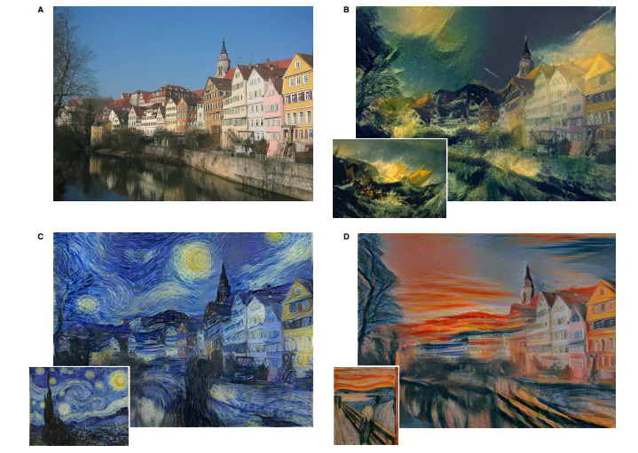

Latest Research in DL - Speech
------------------------------

Synthesizing Obama: Learning Lip Sync from Audio [(Suwajankorn et al. 2017)](http://grail.cs.washington.edu/projects/AudioToObama/)

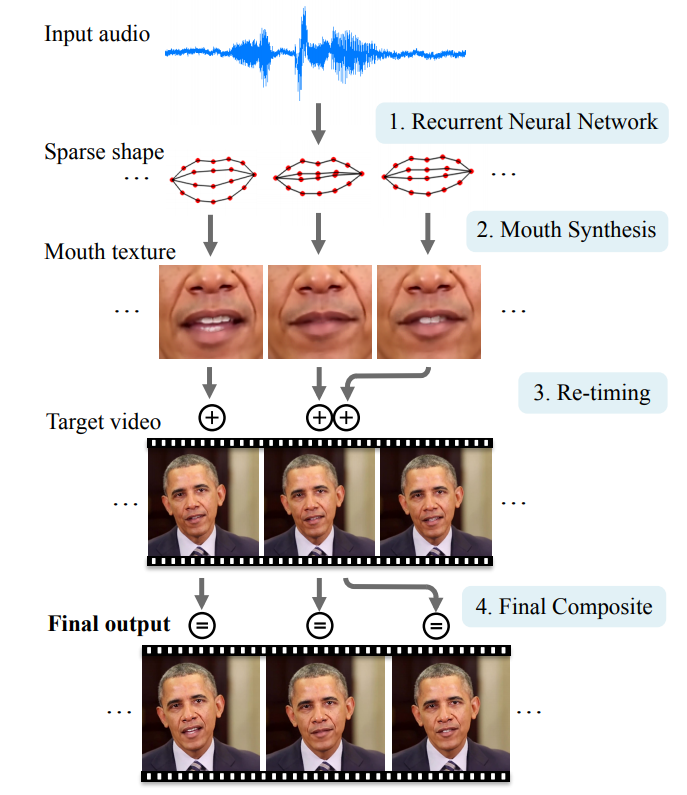

Latest Research in DL - Language
--------------------------------

Character Sequence Models for Colorful Words [(Kawakami et al. 2016)](http://www.colorlab.us)

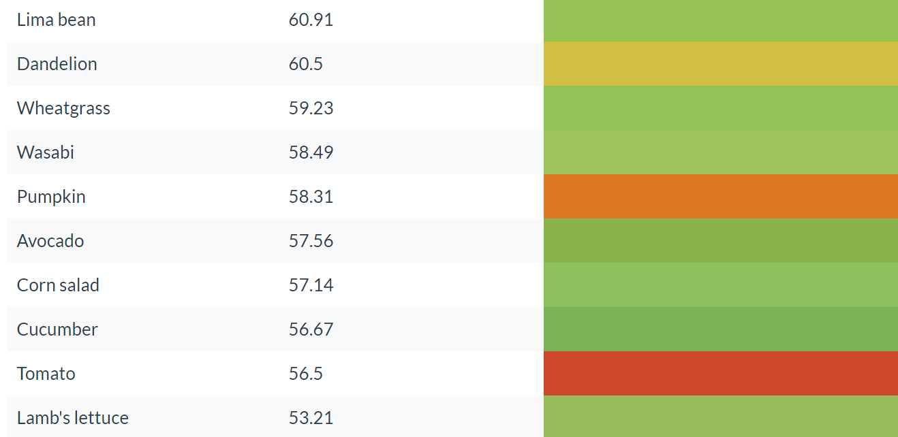

Latest Research in DL - Language
--------------------------------

A Neural Attention Model for Sentence Summarization [(Rush et al. 2016)](https://aclweb.org/anthology/D/D15/D15-1044.pdf)

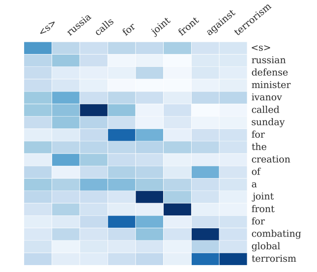

How can we use DL?
------------------

Training a deep neural network usually requires a huge amount of data. For example, the CNNs such as VGG16 and Inception V3 are trained on the ImageNet dataset with **~1.2 million** images of **1,000 different classes**.

* How can one start with DL:
    - collect enough data to start with!
    - use pre-trained models directly
    - use pre-trained models and do fine-tuning, a.k.a. **transfer learning**

Transfer Learning
-----------------

* For common tasks such as image classification, it is likely that filters (feature extractors) trained on one datasets are useful on many other datasets as well
* [Transfer learning](https://en.wikipedia.org/wiki/Transfer_learning) refers to the task of applying knowledge gained in one problem to another different but related problem
* Transfer learning in deep learning
    1. Using a pre-trained neural nework as a **feature extractor**
    2. Perform fine-tuning on a pre-trained network
* Ref: [http://cs231n.github.io/transfer-learning/](http://cs231n.github.io/transfer-learning/)

Transfer Learning (2)
---------------------

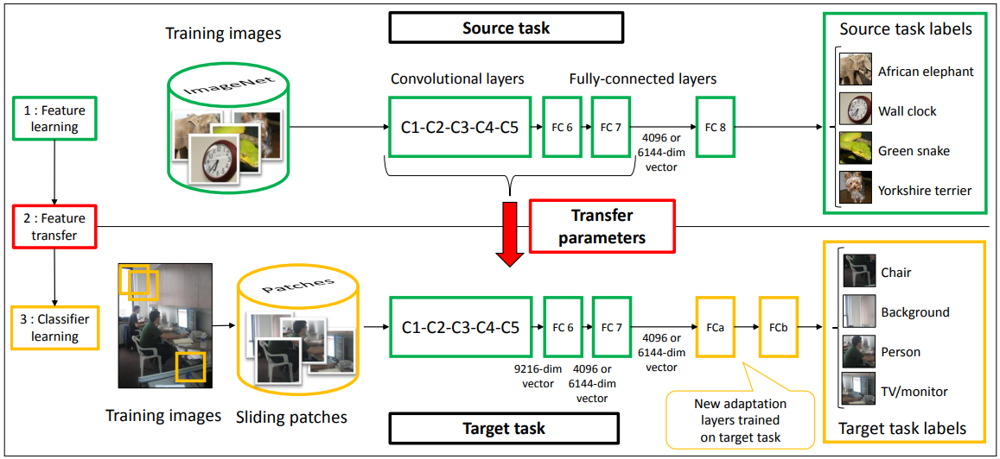 
Ref: Learning and Transferring Mid-Level Image Representations
using Convolutional Neural Networks [(Oquab et al., 2014)](http://www.cv-foundation.org/openaccess/content_cvpr_2014/papers/Oquab_Learning_and_Transferring_2014_CVPR_paper.pdf)

Example of Transfer Learning
----------------------------

* **TourLens** - Recognize ~50 objects for **tourists in Hong Kong**
* Around ~100 training images for each class
* Transfer learning using pre-trained [**AlexNet**](https://en.wikipedia.org/wiki/AlexNet) on ImageNet

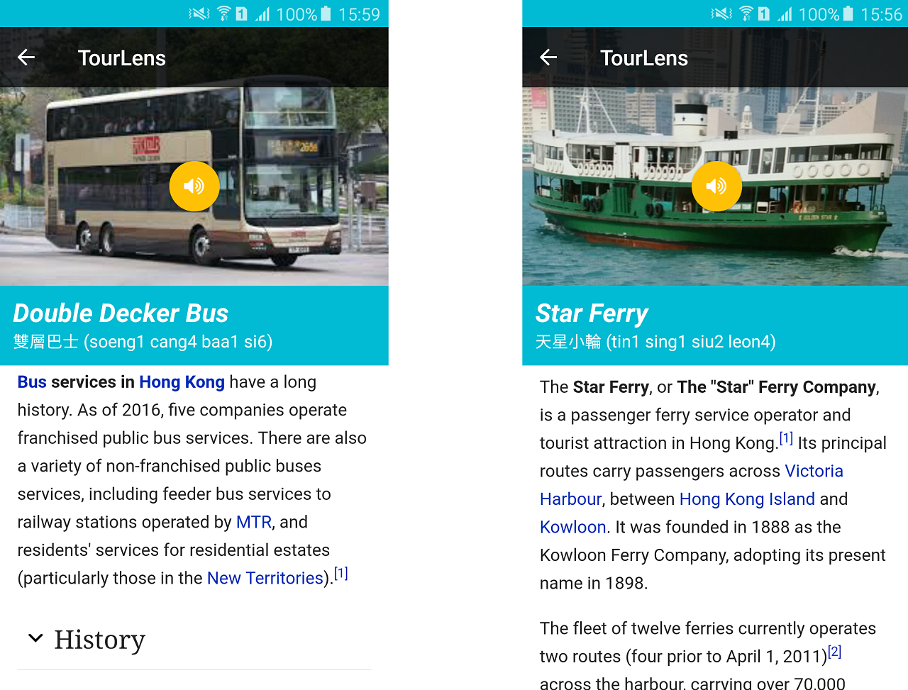

Example of Transfer Learning - Pre-trained Word Embeddings
----------------------------------------------------------

* [Word embeddings]() are dense vector representations of words that reflect their contextual similarity
* Different pre-trained word vectors are available, e.g. [word2vec](https://code.google.com/archive/p/word2vec/), [GloVe](https://nlp.stanford.edu/projects/glove/), [fastText](https://github.com/facebookresearch/fastText/blob/master/pretrained-vectors.md)
* Can be used to initialise the embedding layer when training NLP models

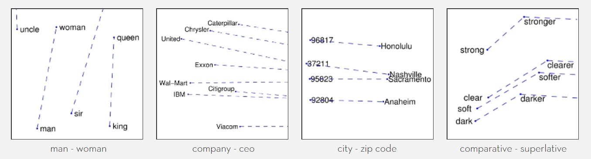 
Ref: GloVe: Global Vectors for Word Representation:
[https://nlp.stanford.edu/projects/glove/](https://nlp.stanford.edu/projects/glove/)

Common Deep Learning Frameworks
-------------------------------

* Tensorflow: [https://www.tensorflow.org/](https://www.tensorflow.org/)
* Torch: [http://torch.ch/](http://torch.ch/)
* Theano: [http://deeplearning.net/software/theano/](http://deeplearning.net/software/theano/)
* Caffe2: [https://caffe2.ai/](https://caffe2.ai/)
* Nnabla: [https://nnabla.org/](https://nnabla.org/)
* MXnet: [http://mxnet.io/](http://mxnet.io/)
* Keras: [https://keras.io](https://keras.io)
* ...

Machine learning and Social Science
-----------------------------------

Machine learning is not only for solving computational problems, but can also be applied to study problems in humanities and social science

* Some examples from myself and my collaborators:
    - [Omnia Mutantur, Nihil Interit: Connecting Past with Present by Finding Corresponding Terms across Time](http://aclweb.org/anthology/P15-1063) (Zhang et al. 2015)
    - [Studying How the Past is Remembered: Towards Computational History through Large Scale Text Mining](http://www.dl.kuis.kyoto-u.ac.jp/~adam/cikm11a.pdf) (Au Yeung & Jatowt, 2011)

Summary
-------

* Deep learning is a powerful machine learning method for solving different tasks, especially when the problem can be defined as a **classification** or **transformation** problem
* Moving from feature engineering to [**'neural network engineering'**](https://research.googleblog.com/2017/05/using-machine-learning-to-explore.html)
* There are many **open source deep learning frameworks** that allow research and development in deep learning to be done more efficiently
* Can deep learning be useful in solving problems in humanities and social science?

The End
-------

Thank you for attending the seminar! Questions are welcome.

Contact me at:

- Email: albertauyeung@gmail.com
- Homepage: [http://www.albertauyeung.com](http://www.albertauyeung.com)
- Github: [https://www.github.com/albertauyeung](https://www.github.com/albertauyeung])
